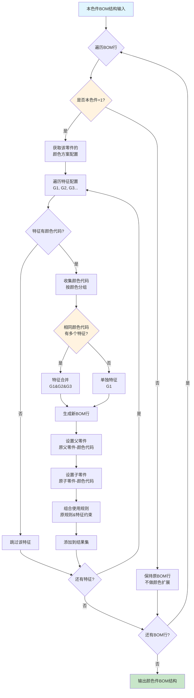
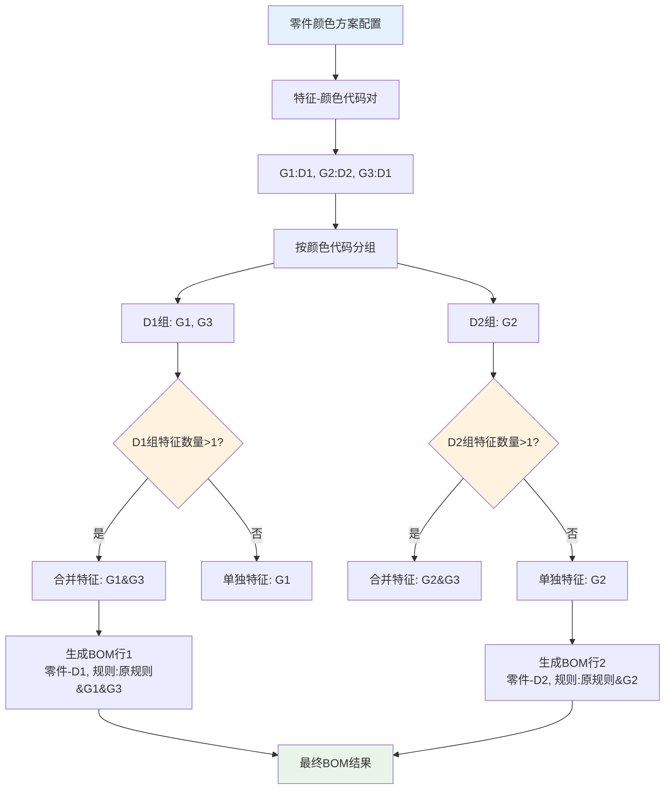
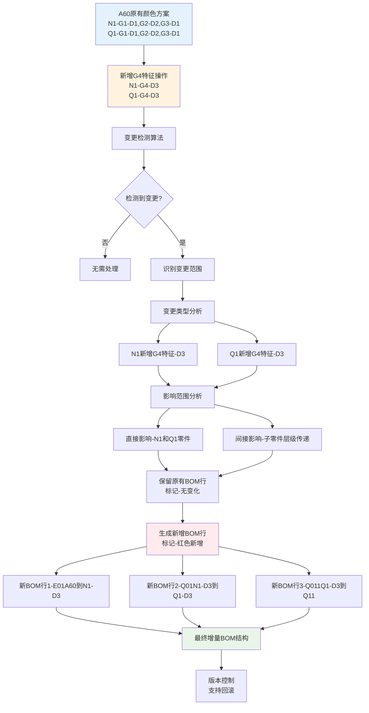

# 颜色方案BOM打散核心算法指南

## 📚 文档大纲

### 第一部分：核心概念
- [1.1 业务场景](#业务场景)
- [1.2 术语定义](#术语定义)
- [1.3 数据结构](#数据结构)

### 第二部分：核心算法
- [2.1 BOM打散核心原则](#BOM打散核心原则)
- [2.2 特征处理算法](#特征处理算法)
- [2.3 颜色传递算法](#颜色传递算法)
- [2.4 规则组合算法](#规则组合算法)

### 第三部分：实战案例
- [3.1 A60产品完整案例](#A60产品完整案例)
- [3.2 新增颜色代码案例](#新增颜色代码案例)
- [3.3 复杂场景案例](#复杂场景案例)

### 第四部分：算法流程图
- [4.1 核心流程图](#核心流程图)
- [4.2 特征合并流程](#特征合并流程)
- [4.3 增量扩展流程](#增量扩展流程)

---

## 🎯 业务场景

### 核心业务需求
颜色方案BOM打散是将**本色件BOM**根据**颜色方案配置**自动扩展为**颜色件BOM**的过程。

### 四大应用场景

#### 场景一：颜色方案发布时打散
- **触发时机** - 颜色方案从草稿状态发布为生效状态
- **数据来源** - 颜色变更中的颜色方案 + 零件使用的BOM行
- **处理方式** - 全量打散生成颜色件BOM

#### 场景二：研发域变更发布时打散
- **触发时机** - 本色件BOM发生变更
- **数据来源** - 发布的本色件BOM + 生效的颜色方案
- **处理方式** - 增量更新受影响的颜色件BOM

#### 场景三：售后变更发布时打散
- **触发时机** - 备件BOM发生变更
- **数据来源** - 发布的备件BOM + 生效的颜色方案
- **处理方式** - 生成颜色件备件BOM

#### 场景四：新增颜色代码扩展
- **触发时机** - 在现有颜色方案中新增颜色代码
- **数据来源** - 原有颜色方案 + 新增的颜色代码配置
- **处理方式** - 增量扩展，保留原有数据，仅生成新增部分

## 📚 术语定义

### 核心术语
| 术语 | 定义 | 示例 |
|------|------|------|
| **本色件** | 是否本色件=1的零件，需要根据颜色方案扩展为颜色件 | N1、Q1、Q21、Q3、N3、Q4 |
| **非本色件** | 是否本色件=0的零件，不参与颜色打散，保持原状 | Q11、Q2、N2 |
| **颜色代码** | 标识具体颜色的编码 | D1、D2、D3、806-1024 |
| **内外饰特征** | 定义颜色应用范围的特征编码 | G1、G2、G3、G4 |
| **扩展特征** | 除内外饰特征外的其他特征约束 | FB01、GC01 |
| **颜色件** | 经过颜色打散后的具体颜色零件 | N1-D1、Q1-D2 |
| **BOM行** | BOM结构中的一行记录，包含父子零件关系 | E01\|A60→N1\|FB01 |
| **使用规则** | 定义零件使用条件的表达式 | FA01&F1、FB01\|GC01 |

### 数据结构
| 实体 | 作用 | 关键字段 |
|------|------|----------|
| **BmColorSchemePO** | 颜色方案主表 | productId(车系)、partId(本色件)、lineNum(BOM行号)、usageExpression(使用规则) |
| **BmColorSchemeDetailsPO** | 颜色方案详情表 | colorCode(颜色代码)、ieDecorationCode(内外饰特征编码) |
| **本色件BOM** | 原始BOM结构 | 父零件、子零件、使用规则、是否本色件 |
| **颜色件BOM** | 打散后BOM结构 | 父零件-颜色代码、子零件-颜色代码、组合使用规则、sourceLineNum(来源行号)、fromPartAssemblyId(来源BOM行ID) |

### 业务状态
| 状态 | 含义 | 处理方式 |
|------|------|----------|
| **草稿** | 编辑中的颜色方案 | 可修改、删除 |
| **生效** | 已发布的颜色方案 | 用于BOM打散 |
| **历史** | 已升版的旧数据 | 仅查看，不参与打散 |

## 🗄️ 数据结构

### 颜色方案主表 (BM_COLOR_SCHEME)
```sql
CREATE TABLE BM_COLOR_SCHEME (
    ID VARCHAR(32) PRIMARY KEY,                    -- 主键ID
    PRODUCT_ID VARCHAR(32) NOT NULL,               -- 车系型谱ID
    PART_ID VARCHAR(32) NOT NULL,                  -- 本色件ID
    LINE_NUM VARCHAR(20),                          -- BOM行号
    USAGE_EXPRESSION TEXT,                         -- 使用规则表达式
    OPERATION_TYPE VARCHAR(10),                    -- 操作类型(新增/修改/删除)
    STATUS VARCHAR(10),                            -- 状态(草稿/生效/历史)
    IS_LATEST BOOLEAN,                             -- 是否最新版本
    VERSION_NO INTEGER,                            -- 版本号
    CHANGE_CODE VARCHAR(50),                       -- 变更单号
    CREATE_TIME TIMESTAMP,                         -- 创建时间
    CREATE_USER VARCHAR(50)                        -- 创建用户
);
```

### 颜色方案详情表 (BM_COLOR_SCHEME_DETAILS)
```sql
CREATE TABLE BM_COLOR_SCHEME_DETAILS (
    ID VARCHAR(32) PRIMARY KEY,                    -- 主键ID
    COLOR_SCHEME_ID VARCHAR(32) NOT NULL,          -- 颜色方案表ID
    COLOR_CODE VARCHAR(20) NOT NULL,               -- 颜色代码
    COLOR_NAME VARCHAR(100),                       -- 颜色名称
    IE_DECORATION_CODE VARCHAR(50),                -- 内外饰特征编码
    SOURCE_COLOR_CODE VARCHAR(20),                 -- 前一版本的颜色代码
    SORT_ORDER INTEGER,                            -- 排序序号
    CREATE_TIME TIMESTAMP,                         -- 创建时间
    FOREIGN KEY (COLOR_SCHEME_ID) REFERENCES BM_COLOR_SCHEME(ID)
);
```

### 本色件BOM结构
```sql
CREATE TABLE BOM_STRUCTURE (
    ID VARCHAR(32) PRIMARY KEY,                    -- 主键ID
    PARENT_PART_ID VARCHAR(32),                    -- 父零件ID
    CHILD_PART_ID VARCHAR(32),                     -- 子零件ID
    LINE_NUMBER VARCHAR(20),                       -- 行号
    USAGE_RULE TEXT,                               -- 使用规则
    IS_COLOR_PART INTEGER,                         -- 是否本色件(1=是,0=否)
    QUANTITY DECIMAL(10,3),                        -- 用量
    LEVEL_NUM INTEGER                              -- 层级
);
```

### 颜色件BOM结构
```sql
CREATE TABLE COLOR_BOM_STRUCTURE (
    ID VARCHAR(32) PRIMARY KEY,                    -- 主键ID
    PARENT_PART_CODE VARCHAR(50),                  -- 父零件编码(含颜色)
    CHILD_PART_CODE VARCHAR(50),                   -- 子零件编码(含颜色)
    LINE_NUMBER VARCHAR(20),                       -- 行号
    USAGE_RULE TEXT,                               -- 组合使用规则
    COLOR_CODE VARCHAR(20),                        -- 颜色代码
    FEATURE_CODE VARCHAR(50),                      -- 特征编码
    QUANTITY DECIMAL(10,3),                        -- 用量
    LEVEL_NUM INTEGER,                             -- 层级
    CHANGE_STATUS VARCHAR(10),                     -- 变更状态(新增/修改/删除/无变化)
    SOURCE_BOM_ID VARCHAR(32)                      -- 来源本色件BOM ID
);
```

## 🔧 BOM打散核心原则

### 原则一：颜色件BOM行识别原则
**定义：** 判断依据是BOM行的sourceLineNum字段不为空，表示这是一个颜色件BOM行。

**实现逻辑：**
```
FOR EACH BOM行 IN BOM结构:
    IF (BOM行.sourceLineNum IS NOT NULL AND BOM行.sourceLineNum ≠ '') THEN
        这是颜色件BOM行，需要处理颜色打散逻辑
    ELSE
        这是本色件BOM行，保持原状
```

**字段说明：**
- **sourceLineNum** - 来源行号，颜色件BOM行记录的是本色件BOM行号
- **fromPartAssemblyId** - 来源的BOM行ID，记录本色件BOM行的ID

**应用场景：**
- 父子零件任意一个零件是颜色件时，这个BOM行就是颜色件BOM行
- 颜色件BOM行需要基于颜色方案进行打散处理

### 原则二：特征映射原则
**定义：** 基于内外饰特征与颜色代码的映射关系生成颜色件BOM。

**映射规则：**
- 一个特征可以对应一个颜色代码：G1 → D1
- 多个特征可以对应同一个颜色代码：G1 → D1, G3 → D1
- 一个特征不能对应多个颜色代码（业务约束）

**处理逻辑：**
```
FOR EACH 特征 IN [G1, G2, G3, G4, ...]:
    IF (特征.颜色代码 ≠ NULL AND 特征.颜色代码 ≠ '-') THEN
        创建特征-颜色代码映射
        生成对应的BOM行
```

### 原则三：颜色传递原则
**定义：** 父零件的颜色信息向子零件传递，形成完整的颜色件BOM层级结构。

**传递规则：**
- 如果父零件是本色件且已扩展颜色，子零件的父零件字段更新为"父零件-颜色代码"
- 如果子零件是本色件，扩展为"子零件-颜色代码"
- 如果子零件是非本色件，保持原零件编码不变

**传递示例：**
```
原BOM: Q01|N1→Q1|
父零件N1扩展为: N1-D1, N1-D2
传递结果:
- Q01|N1-D1→Q1-D1|G1&G3 (Q1是本色件，扩展颜色)
- Q01|N1-D2→Q1-D2|G2 (Q1是本色件，扩展颜色)
```

### 原则四：规则组合原则
**定义：** 新的使用规则由本色件BOM行使用规则、颜色方案中使用条件和内外饰特征组合而成。

**组合公式：**
```
新使用规则 = (本色件BOM行使用规则) & (颜色方案中使用条件) & (内外饰特征、扩展特征用&连接)
```

**组合示例：**
- 本色件P1的使用规则：FB01
- 颜色方案中P1的使用特征：GC01
- G1特征下有D色码
- 组合结果：FB01 & GC01 & G1

### 原则五：增量扩展原则
**定义：** 在现有颜色方案基础上新增颜色代码时，采用增量机制，保留原有数据不变。

**增量策略：**
- 保留原有BOM行，标记为"无变化"
- 仅为新增的颜色代码生成新BOM行
- 新增的BOM行标记为"新增"状态（红色标识）
- 支持版本控制和回滚机制

### 原则六：特征合并原则
**定义：** 相同颜色代码的不同特征应合并为一条BOM行，减少冗余。

**合并逻辑：**
```
按颜色代码分组特征:
    D1组: [G1, G3]  → 合并为 G1&G3
    D2组: [G2]      → 保持为 G2
```

**合并效果：**
- 减少BOM行数量
- 简化使用规则表达式
- 提高系统性能

### 原则七：打散后颜色件BOM行约束原则
**定义：** 打散后的颜色件BOM行中，父零件或者子零件有可能是颜色件，但是不能同时都是颜色件。

**约束规则：**
```
打散后的颜色件BOM行中：
IF (父零件是颜色件 AND 子零件是颜色件) THEN
    违反业务规则，需要特殊处理
ELSE
    符合业务规则，正常生成
```

**允许的组合：**
- 本色件父零件 → 非本色件子零件 ✓ (如：N1 → Q2)
- 非本色件父零件 → 本色件子零件 ✓ (如：Q2 → Q21)
- 非本色件父零件 → 非本色件子零件 ✓ (如：A60 → N2)
- 颜色件父零件 → 颜色件子零件 ✓ (如：N1-D1 → Q1-D1)

**不允许的组合：**
- 本色件父零件 → 本色件子零件 ✗ (如：N1 → Q1，在打散后的BOM行中)

**处理策略：**
当原始BOM中存在本色件→本色件关系时，打散算法需要采用特殊策略确保生成的颜色件BOM行符合约束。

## 🎨 特征处理算法

### 特征解析算法
**目的：** 将管道符分隔的特征编码字符串解析为特征列表

**算法实现：**
```
INPUT: ieDecorationCode = "G1|G2|G3"
OUTPUT: featureList = ["G1", "G2", "G3"]

ALGORITHM parseFeatures(ieDecorationCode):
1. IF (ieDecorationCode IS NULL OR ieDecorationCode = '') THEN
     RETURN empty list
2. features = split(ieDecorationCode, '|')
3. validFeatures = []
4. FOR EACH feature IN features:
     IF (feature IS NOT NULL AND feature ≠ '' AND feature ≠ '-') THEN
       validFeatures.add(trim(feature))
5. RETURN validFeatures
```

### 特征映射算法
**目的：** 将特征与颜色代码建立映射关系，并按颜色代码分组

**算法实现：**
```
INPUT:
- featureList = ["G1", "G2", "G3"]
- colorSchemeDetails = [{feature: "G1", colorCode: "D1"},
                       {feature: "G2", colorCode: "D2"},
                       {feature: "G3", colorCode: "D1"}]

OUTPUT: colorGroups = {D1: ["G1", "G3"], D2: ["G2"]}

ALGORITHM mapFeaturesToColors(featureList, colorSchemeDetails):
1. colorGroups = new Map()
2. FOR EACH detail IN colorSchemeDetails:
     IF (detail.feature IN featureList AND detail.colorCode IS NOT NULL) THEN
       IF (colorGroups.containsKey(detail.colorCode)) THEN
         colorGroups.get(detail.colorCode).add(detail.feature)
       ELSE
         colorGroups.put(detail.colorCode, [detail.feature])
3. RETURN colorGroups
```

### 特征合并算法
**目的：** 将相同颜色代码的多个特征合并为一个表达式

**算法实现：**
```
INPUT: colorGroups = {D1: ["G1", "G3"], D2: ["G2"]}
OUTPUT: mergedFeatures = {D1: "G1&G3", D2: "G2"}

ALGORITHM mergeFeatures(colorGroups):
1. mergedFeatures = new Map()
2. FOR EACH (colorCode, features) IN colorGroups:
     IF (features.size() = 1) THEN
       mergedFeatures.put(colorCode, features.get(0))
     ELSE
       mergedExpression = join(features, '&')
       mergedFeatures.put(colorCode, mergedExpression)
3. RETURN mergedFeatures
```

## 🔄 颜色传递算法

### 递归传递算法（含约束处理）
**目的：** 将父零件的颜色信息递归传递给所有子零件，同时确保符合约束

**算法实现：**
```
ALGORITHM propagateColor(parentPart, colorCode, featureExpression, level, bomStructure, parentIsColorPart):
1. // 获取当前零件的所有子零件
   childParts = getChildParts(parentPart, bomStructure)

2. FOR EACH childPart IN childParts:
     // 构造父零件编码（含颜色）
     parentPartWithColor = parentPart + "-" + colorCode

     IF (childPart.isColorPart = 1) THEN
       // 约束检查：父零件是颜色件且子零件是本色件
       IF (parentIsColorPart = true) THEN
         // 违反约束：子零件不扩展颜色，保持本色
         createColorBOMLine(
           parentPartWithColor,
           childPart.partCode,  // 不添加颜色后缀
           childPart.lineNumber,
           combineUsageRules(childPart.usageRule, featureExpression),
           colorCode,
           featureExpression,
           level
         )

         // 递归处理下一层级，标记父零件为非颜色件
         propagateColor(childPart.partCode, colorCode, featureExpression, level + 1, bomStructure, false)
       ELSE
         // 正常处理：本色件扩展颜色
         childPartWithColor = childPart.partCode + "-" + colorCode

         createColorBOMLine(
           parentPartWithColor,
           childPartWithColor,
           childPart.lineNumber,
           combineUsageRules(childPart.usageRule, featureExpression),
           colorCode,
           featureExpression,
           level
         )

         // 递归处理下一层级，标记父零件为颜色件
         propagateColor(childPart.partCode, colorCode, featureExpression, level + 1, bomStructure, true)

     ELSE
       // 非本色件：保持原样
       createColorBOMLine(
         parentPartWithColor,
         childPart.partCode,
         childPart.lineNumber,
         childPart.usageRule,
         colorCode,
         featureExpression,
         level
       )
```

### 批量传递算法
**目的：** 为所有颜色代码批量执行传递操作

**算法实现：**
```
ALGORITHM batchPropagateColors(rootPart, colorGroups, bomStructure):
1. colorBOMResults = []

2. FOR EACH (colorCode, features) IN colorGroups:
     // 合并特征表达式
     featureExpression = join(features, '&')

     // 为当前颜色代码执行传递
     propagateColor(rootPart, colorCode, featureExpression, 1, bomStructure)

3. RETURN colorBOMResults
```

## 🔗 规则组合算法

### 使用规则组合算法
**目的：** 将原BOM使用规则、颜色方案使用条件和特征约束组合为新的使用规则

**算法实现：**
```
ALGORITHM combineUsageRules(originalRule, colorSchemeRule, featureExpression):
1. ruleComponents = []

2. // 添加原BOM使用规则
   IF (originalRule IS NOT NULL AND originalRule ≠ '') THEN
     ruleComponents.add(originalRule)

3. // 添加颜色方案使用条件
   IF (colorSchemeRule IS NOT NULL AND colorSchemeRule ≠ '') THEN
     ruleComponents.add(colorSchemeRule)

4. // 添加特征约束
   IF (featureExpression IS NOT NULL AND featureExpression ≠ '') THEN
     ruleComponents.add(featureExpression)

5. // 组合所有规则
   IF (ruleComponents.isEmpty()) THEN
     RETURN NULL
   ELSE
     RETURN join(ruleComponents, '&')
```

### 规则优化算法
**目的：** 优化组合后的使用规则表达式，去除冗余

**算法实现：**
```
ALGORITHM optimizeUsageRule(combinedRule):
1. IF (combinedRule IS NULL OR combinedRule = '') THEN
     RETURN NULL

2. // 分解规则表达式
   ruleComponents = split(combinedRule, '&')

3. // 去重
   uniqueComponents = removeDuplicates(ruleComponents)

4. // 排序（可选，便于阅读）
   sortedComponents = sort(uniqueComponents)

5. // 重新组合
   RETURN join(sortedComponents, '&')
```

## 📊 A60产品完整案例

### 基础数据

#### 本色件BOM结构
| 层级 | 行号 | 父零件 | 子零件 | 使用规则 | 是否本色件 |
|------|------|--------|--------|----------|------------|
| 1    | E01  | A60    | N1     | FB01     | 1          |
| 2    | Q01  | N1     | Q1     |          | 1          |
| 3    | Q011 | Q1     | Q11    |          | 0          |
| 2    | Q02  | N1     | Q2     |          | 0          |
| 3    | Q021 | Q2     | Q21    |          | 1          |
| 1    | E02  | A60    | N2     | FB01     | 0          |
| 2    | Q03  | N2     | Q3     |          | 1          |
| 1    | E03  | A60    | N3     | FB01     | 1          |
| 2    | Q04  | N3     | Q4     |          | 1          |

**BOM结构说明：**
- **情况1：本色件→本色件**：N1(本色件)→Q1(本色件)、N3(本色件)→Q4(本色件)
- **情况2：本色件→非本色件**：N1(本色件)→Q2(非本色件)、Q1(本色件)→Q11(非本色件)
- **情况3：非本色件→本色件**：Q2(非本色件)→Q21(本色件)、N2(非本色件)→Q3(本色件)
- **情况4：非本色件→非本色件**：A60(非本色件)→N2(非本色件)、Q1(本色件)→Q11(非本色件)

**打散约束处理：**
对于本色件→本色件的情况，打散算法需要确保生成的颜色件BOM行符合约束。

#### 颜色方案配置
| 零件号 | BOM行号 | 使用特征 | G1 | G2 | G3 |
|--------|---------|----------|----|----|----|
| N1     |         |          | D1 | D2 | D1 |
| Q1     |         |          | D1 | D2 | D1 |
| Q21    |         |          | D1 | D3 | D3 |
| Q3     |         |          | D2 | D3 |    |
| N3     | E03     | GC01     | D2 |    |    |
| Q4     |         |          | D1 | D2 |    |

**说明：** 只有本色件才需要配置颜色方案，非本色件(Q11、Q2、N2)不参与颜色打散。

### 算法执行过程

#### 第1步：特征解析与映射
```
N1零件特征映射:
- G1 → D1, G2 → D2, G3 → D1
- 按颜色分组: {D1: [G1, G3], D2: [G2]}
- 特征合并: {D1: "G1&G3", D2: "G2"}

Q1零件特征映射:
- G1 → D1, G2 → D2, G3 → D1
- 按颜色分组: {D1: [G1, G3], D2: [G2]}
- 特征合并: {D1: "G1&G3", D2: "G2"}

Q21零件特征映射:
- G1 → D1, G2 → D3, G3 → D3
- 按颜色分组: {D1: [G1], D3: [G2, G3]}
- 特征合并: {D1: "G1", D3: "G2&G3"}

Q3零件特征映射:
- G1 → D2, G2 → D3
- 按颜色分组: {D2: [G1], D3: [G2]}
- 特征合并: {D2: "G1", D3: "G2"}

Q4零件特征映射:
- G1 → D1, G2 → D2
- 按颜色分组: {D1: [G1], D2: [G2]}
- 特征合并: {D1: "G1", D2: "G2"}
```

#### 第2步：BOM打散执行（含约束处理）
```
N1零件打散:
原BOM: E01|A60→N1|FB01
生成结果:
- E01|A60→N1-D1|FB01&(G1&G3)
- E01|A60→N1-D2|FB01&G2

Q1零件打散:
原BOM: Q01|N1→Q1|
父零件传递: N1-D1, N1-D2
生成结果:
- Q01|N1-D1→Q1-D1|G1&G3
- Q01|N1-D2→Q1-D2|G2

Q21零件打散:
原BOM: Q021|Q2→Q21|
父零件传递: Q2(非本色件，保持原状)
生成结果:
- Q021|Q2→Q21-D1|G1
- Q021|Q2→Q21-D3|G2&G3

Q3零件打散:
原BOM: Q03|N2→Q3|
父零件传递: N2(非本色件，保持原状)
生成结果:
- Q03|N2→Q3-D2|G1
- Q03|N2→Q3-D3|G2

Q4零件打散:
原BOM: Q04|N3→Q4|
父零件传递: N3-D2
生成结果:
- Q04|N3-D2→Q4-D1|GC01&G1
- Q04|N3-D2→Q4-D2|GC01&G2
```

#### 第3步：完整打散结果
| 序号 | 层级 | BOM行号 | 父零件    | 子零件    | 使用规则          | 生成逻辑                                    |
|------|------|---------|-----------|-----------|-------------------|---------------------------------------------|
| 1    | 1    | E01     | A60       | N1-D1     | FB01&(G1&G3)      | 本色件N1在G1&G3特征下=D1（特征合并）        |
| 2    | 2    | Q01     | N1-D1     | Q1-D1     | G1&G3             | 本色件Q1继承父零件颜色，在G1&G3特征下=D1    |
| 3    | 3    | Q011    | Q1-D1     | Q11       | 空                | 非本色件Q11，不参与打散                     |
| 4    | 2    | Q02     | N1-D1     | Q2        | 空                | 非本色件Q2，不参与打散                      |
| 5    | 3    | Q021    | Q2        | Q21-D1    | G1                | 本色件Q21根据自身颜色方案在G1特征下=D1      |
| 6    | 1    | E01     | A60       | N1-D2     | FB01&G2           | 本色件N1在G2特征下=D2                       |
| 7    | 2    | Q01     | N1-D2     | Q1-D2     | G2                | 本色件Q1继承父零件颜色，在G2特征下=D2       |
| 8    | 3    | Q011    | Q1-D2     | Q11       | 空                | 非本色件Q11，不参与打散                     |
| 9    | 2    | Q02     | N1-D2     | Q2        | 空                | 非本色件Q2，不参与打散                      |
| 10   | 3    | Q021    | Q2        | Q21-D3    | G2&G3             | 本色件Q21根据自身颜色方案在G2&G3特征下=D3   |
| 11   | 1    | E02     | A60       | N2        | FB01              | 非本色件N2，不参与打散                      |
| 12   | 2    | Q03     | N2        | Q3-D2     | G1                | 本色件Q3根据自身颜色方案在G1特征下=D2       |
| 13   | 2    | Q03     | N2        | Q3-D3     | G2                | 本色件Q3根据自身颜色方案在G2特征下=D3       |
| 14   | 1    | E03     | A60       | N3-D2     | FB01&GC01&G1      | 本色件N3混合特征配置：E03=GC01, G1=D2       |
| 15   | 2    | Q04     | N3-D2     | Q4-D1     | GC01&G1           | 本色件Q4继承父零件特征，在G1特征下=D1       |
| 16   | 2    | Q04     | N3-D2     | Q4-D2     | GC01&G2           | 本色件Q4继承父零件特征，在G2特征下=D2       |

### 验证结果
- **本色件打散** - 6个本色件(N1、Q1、Q21、Q3、N3、Q4)正确扩展为颜色件
- **非本色件处理** - 3个非本色件(Q11、Q2、N2)保持原状
- **约束验证** - 所有打散结果都符合"父子零件不能同时都是本色件"的原则：
  - 颜色件父零件 → 颜色件子零件：N1-D1→Q1-D1 ✓ (符合约束)
  - 颜色件父零件 → 非颜色件子零件：N1-D1→Q2 ✓ (符合约束)
  - 非颜色件父零件 → 颜色件子零件：Q2→Q21-D1 ✓ (符合约束)
  - 非颜色件父零件 → 颜色件子零件：N2→Q3-D2 ✓ (符合约束)
  - 颜色件父零件 → 颜色件子零件：N3-D2→Q4-D1 ✓ (符合约束)
- **特征合并** - 相同颜色代码的特征正确合并
- **使用规则组合** - 使用规则正确组合

**✅ 约束符合性验证：**
所有打散结果都严格遵守业务约束。约束是"不能同时都是本色件"，而颜色件→颜色件完全符合要求。
打散算法正确地将本色件扩展为颜色件，确保了业务规则的正确执行。

## 🆕 新增颜色代码案例

### 业务场景
在A60产品已有颜色方案基础上，新增G4特征和相关颜色代码的增量扩展处理。

### 原有配置
```
零件号 | BOM行号 | 使用条件 | G1 | G2 | G3 | G4
N1     |         |          | D1 | D2 | D1 | -
Q1     |         |          | D1 | D2 | D1 | -
Q21    |         |          | D1 | D3 | D3 | -
Q3     |         |          | D2 | D3 | -  | -
N3     | E03     | GC01     | D2 | -  | -  | -
Q4     |         |          | D1 | D2 | -  | -
```

### 新增变更
```
变更内容:
1. 新增G4特征，N1、Q1在G4特征下配置颜色代码D3
2. Q21在G4特征下新增颜色代码D2
3. Q3在G4特征下新增颜色代码D1
```

### 增量扩展算法
```
ALGORITHM incrementalExpansion(originalConfig, newConfig):
1. // 变更检测
   changes = detectChanges(originalConfig, newConfig)

2. // 影响分析
   affectedParts = analyzeImpact(changes)

3. // 保留原有数据
   preserveExistingBOM(originalBOM, "无变化")

4. // 生成新增数据
   FOR EACH change IN changes:
     IF (change.type = "NEW_FEATURE" OR change.type = "NEW_COLOR") THEN
       newBOMLines = generateIncrementalBOM(change)
       markBOMLines(newBOMLines, "新增", "红色标识")

5. // 合并结果
   finalBOM = merge(originalBOM, newBOMLines)

6. RETURN finalBOM
```

### 新增后配置
```
零件号 | BOM行号 | 使用条件 | G1 | G2 | G3 | G4
N1     |         |          | D1 | D2 | D1 | D3 ← 新增G4特征
Q1     |         |          | D1 | D2 | D1 | D3 ← 新增G4特征
Q21    |         |          | D1 | D3 | D3 | D2 ← 新增G4特征
Q3     |         |          | D2 | D3 | -  | D1 ← 新增G4特征
N3     | E03     | GC01     | D2 | -  | -  | -  ← N3不涉及G4
Q4     |         |          | D1 | D2 | -  | -  ← Q4不涉及G4
```

### 增量BOM生成结果
```
新增的BOM行（红色标识）:
E01|A60→N1-D3|FB01&G4 → 新增（G4特征新增）
Q01|N1-D3→Q1-D3|G4 → 新增（层级传递）
Q011|Q1-D3→Q11| → 新增（非本色件保持）
Q02|N1-D3→Q2| → 新增（非本色件保持）
Q021|Q2→Q21-D2|G4 → 新增（Q21的G4特征变化）
Q03|N2→Q3-D1|G4 → 新增（Q3的G4特征）
```

### 增量扩展核心规则
1. **增量识别** - 通过对比原配置和新配置识别变更点
2. **影响范围分析** - 分析变更对BOM结构的影响范围
3. **保留原有数据** - 所有原有BOM行保持不变，标记为"无变化"
4. **生成新增数据** - 仅为新增的颜色代码生成新BOM行
5. **状态标识** - 新增的BOM行用红色标识，便于识别

## 🔄 核心流程图

### BOM打散主流程


### 特征合并流程


### 增量扩展流程


## 📊 复杂场景案例

### 场景：跨层级颜色传递
**业务描述：** 当父零件有多个颜色代码时，如何正确传递给多层级的子零件。

**BOM结构：**
```
Level 1: A60 (整车)
├── Level 2: N1 (总成, 本色件) - 配置: G1→D1, G2→D2, G3→D1
│   ├── Level 3: Q1 (子总成, 本色件) - 配置: G1→D1, G2→D2, G3→D1
│   │   └── Level 4: Q11 (零件, 非本色件)
│   └── Level 3: Q2 (零件, 非本色件)
│       └── Level 4: Q21 (零件, 本色件) - 配置: G1→D1, G2→D3, G3→D3
```

**传递算法执行：**
```
第1层传递: A60 → N1
- N1-D1 (G1&G3特征合并)
- N1-D2 (G2特征)

第2层传递: N1 → Q1, Q2
- N1-D1 → Q1-D1 (Q1是本色件，扩展颜色)
- N1-D1 → Q2 (Q2是非本色件，保持原样)
- N1-D2 → Q1-D2 (Q1是本色件，扩展颜色)
- N1-D2 → Q2 (Q2是非本色件，保持原样)

第3层传递: Q1 → Q11, Q2 → Q21
- Q1-D1 → Q11 (Q11是非本色件，保持原样)
- Q1-D2 → Q11 (Q11是非本色件，保持原样)
- Q2 → Q21-D1 (Q21是本色件，根据自身方案扩展)
- Q2 → Q21-D3 (Q21是本色件，根据自身方案扩展)
```

**最终结果：**
```
E01|A60→N1-D1|FB01&(G1&G3)
E01|A60→N1-D2|FB01&G2
Q01|N1-D1→Q1-D1|G1&G3
Q01|N1-D2→Q1-D2|G2
Q011|Q1-D1→Q11|
Q011|Q1-D2→Q11|
Q02|N1-D1→Q2|
Q02|N1-D2→Q2|
Q021|Q2→Q21-D1|G1
Q021|Q2→Q21-D3|G2&G3
```

### 场景：混合特征配置
**业务描述：** 零件同时配置内外饰特征和扩展特征时的处理。

**配置示例：**
```
零件N3配置:
- BOM行号: E03
- 扩展特征: GC01 (工艺特征)
- 内外饰特征: G1→D2
- 使用规则: FB01
```

**规则组合结果：**
```
最终使用规则 = FB01 & GC01 & G1
生成BOM行: E03|A60→N3-D2|FB01&GC01&G1
```

## 🎯 算法优化策略

### 性能优化
1. **批量处理** - 将相同颜色代码的零件批量处理，减少重复计算
2. **缓存机制** - 缓存已计算的特征映射结果，避免重复解析
3. **并行处理** - 对独立的BOM分支进行并行处理
4. **索引优化** - 建立零件-特征-颜色的索引，加速查询

### 内存优化
1. **流式处理** - 对大批量数据采用流式处理，避免内存溢出
2. **分页处理** - 将大型BOM结构分页处理
3. **对象复用** - 复用临时对象，减少GC压力

### 算法复杂度
- **时间复杂度** - O(n×m×k)，其中n为BOM行数，m为颜色代码数，k为特征数
- **空间复杂度** - O(n×m)，主要用于存储生成的颜色件BOM
- **优化后复杂度** - 通过缓存和索引可降低到O(n×m)

---

*文档版本：v1.0*
*生成时间：2025-08-20*
*专注于核心算法逻辑和业务规则*
*包含完整的算法实现、实战案例和流程图*
